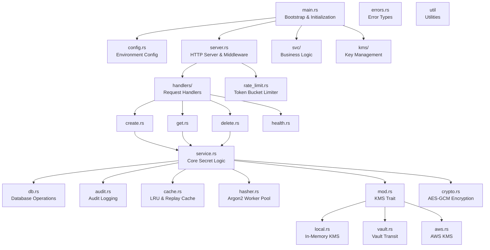
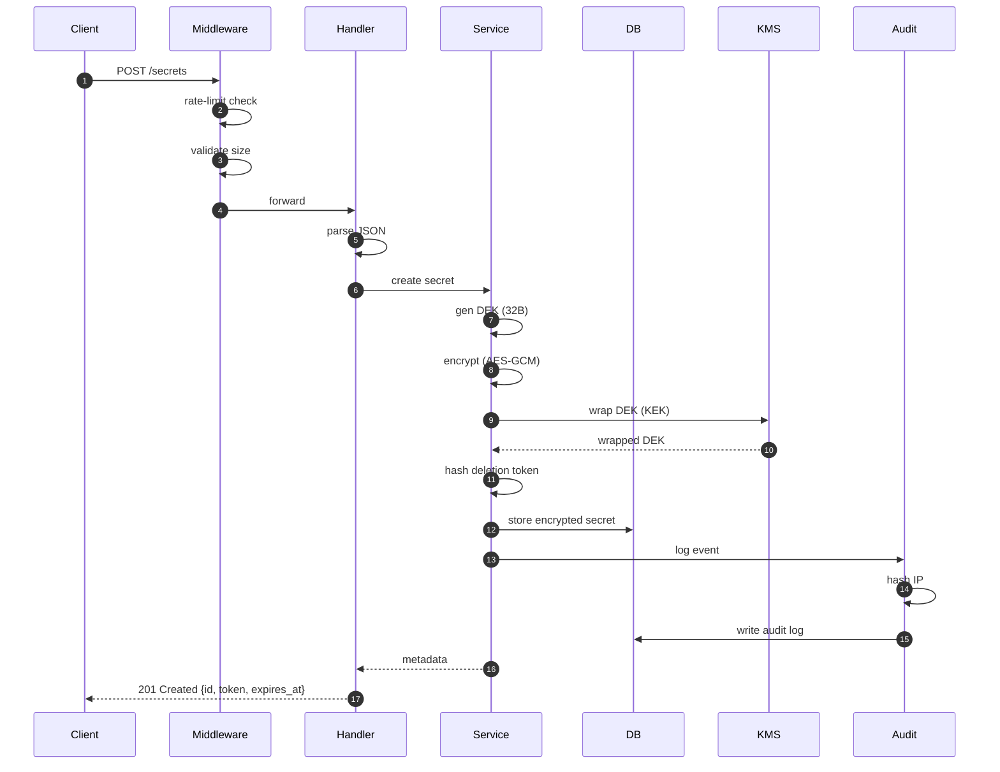
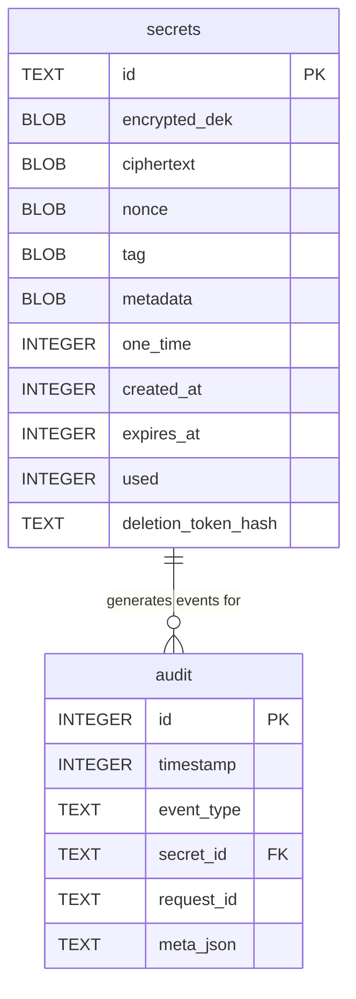
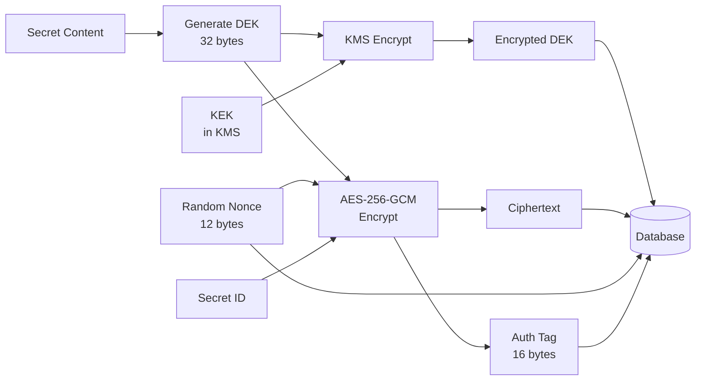
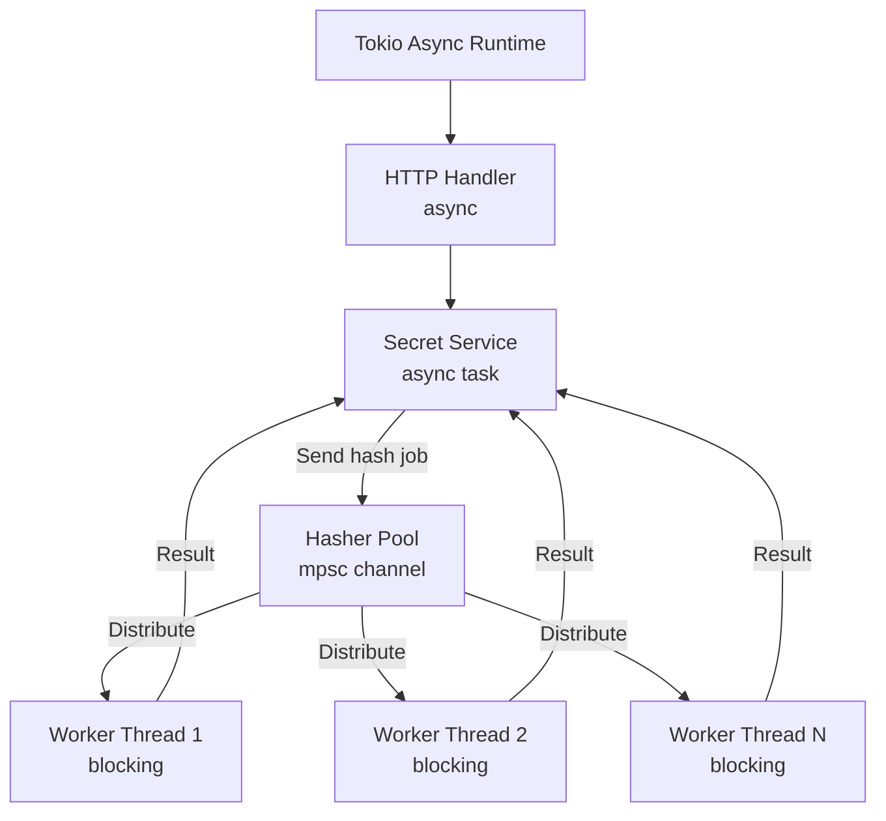

# Architecture

This document provides a deep technical examination of Fugata's system design, and implementation details.

## System Overview

Fugata follows a layered architecture with clear separation between HTTP handling, business logic, and storage. The backend is built on the Axum web framework with Tower middleware, using Tokio for async runtime. The architecture emphasizes fail-secure defaults and explicit error handling.

## Component Structure

You may need to zoom out to see the full diagram.

The main.rs file handles application bootstrap, initializing all components in the correct order: configuration loading, logging setup, KMS provider initialization, database connection and migrations, cache and worker pool creation, and finally HTTP server startup.

The config.rs module loads all environment variables and validates them before the application starts. All configuration errors are fatal and prevent startup, following a fail-fast principle.

The server.rs module builds the Axum router and configures the middleware stack. Middleware is applied in a specific order: tracing first for observability, then CORS for cross-origin requests, rate limiting for abuse prevention, body size limits for memory protection, and finally request timeouts to prevent hanging connections.

## Request Flow

When a client creates a secret, the request first passes through the middleware stack. The rate limiter checks the client IP against the token bucket, rejecting the request with HTTP 429 if the limit is exceeded. The body size limit ensures the payload does not exceed MAX_SECRET_SIZE plus a small buffer for JSON overhead. The timeout middleware ensures the request completes within 30 seconds or is automatically cancelled.

The create handler parses the JSON request body using Serde, validating that the duration matches one of the configured TTL_PRESETS. The handler then delegates to the SecretService for business logic.

The service layer generates a fresh 32-byte DEK using the system's cryptographic random number generator. It encrypts the secret content using AES-256-GCM with the DEK, a randomly generated 96-bit nonce, and the secret ID as additional authenticated data. This binds the ciphertext to the specific secret ID, preventing ciphertext from being moved between secrets.

The service then sends the DEK to the KMS backend for wrapping. The KMS encrypts the DEK using the KEK, returning the encrypted DEK bytes. The original DEK is then zeroized from memory.

The deletion token is hashed using Argon2id through the hasher worker pool. This operation is CPU-intensive, so it runs on a dedicated thread pool to avoid blocking the async runtime.

Finally, the service stores the encrypted data in the database and writes an audit log entry. The audit logger hashes the client IP before storage. If the audit write fails, the entire transaction rolls back and the request fails with HTTP 500, implementing fail-closed audit logging.

## Data Storage

The database schema uses two tables: secrets for encrypted content and audit for event logs.

The secrets table stores all encrypted data. The id column is the primary key, a base58-encoded random value prefixed with "fug_". The encrypted_dek contains the DEK wrapped by the KMS. The ciphertext, nonce, and tag columns together hold the AES-GCM encrypted content. The metadata column is optional plaintext for user labels. The one_time and used flags control deletion behavior. Timestamps are stored as Unix epochs. The deletion_token_hash is an Argon2id hash of the bearer token used for manual deletion.

The audit table logs all secret lifecycle events. The event_type column contains one of: created, accessed, deleted, or expired. The secret_id provides correlation. The request_id allows tracking multiple events from the same HTTP request. The meta_json column stores additional data as JSON, including the hashed IP address.

Indexes exist on secrets.expires_at for cleanup queries and on a partial index for secrets.used where one_time is true. The audit table has indexes on timestamp, secret_id, and event_type for efficient querying.

## Encryption Implementation

The system uses a DEK/KEK model for encryption. Each secret gets a unique Data Encryption Key that never touches persistent storage in plaintext. The Key Encryption Key lives in the KMS and is used only to wrap and unwrap DEKs.

The DEK is 256 bits of cryptographic random data. AES-256-GCM uses this key with a 96-bit random nonce. The nonce must be unique for each encryption operation with the same key, which is guaranteed by generating fresh random values. The additional authenticated data includes the secret ID, which prevents an attacker with database access from moving ciphertext to a different secret entry.

The KMS backends implement a common trait with three methods: encrypt_dek for wrapping, decrypt_dek for unwrapping, and health_check for verifying KMS availability. The Local backend stores the KEK in process memory and does wrapping/unwrapping directly. The Vault backend makes HTTP calls to Vault's transit engine. The AWS backend uses the AWS SDK to call KMS APIs.

## Concurrency Model

Fugata uses Tokio for async I/O and structured concurrency. Database queries, KMS calls, and HTTP requests all use async/await. The rate limiter uses DashMap, a concurrent HashMap with sharded locking that allows lock-free reads.

The hasher pool is a special case because Argon2id is computationally intensive and benefits from blocking thread execution. The pool starts a configured number of threads at startup. Each thread pulls hash jobs from an mpsc channel, performs the hash synchronously, and sends the result back through a oneshot channel. This keeps the expensive CPU work off the Tokio runtime while still allowing async code to await the results.

All shared state uses Arc for thread-safe reference counting. Mutexes are async-aware and use parking_lot under the hood for better performance. Critical sections are kept small to minimize contention.

## Rate Limiting

The rate limiter implements a token bucket algorithm with per-IP tracking. Each IP address gets a virtual bucket that starts full and refills at the configured rate. Each request consumes one token. If the bucket is empty, the request is rejected.

The bucket refill calculation happens on-demand during limit checks rather than through background tasks. When checking a limit, the code calculates how many tokens should have been added since the last check based on elapsed time and the refill rate. This avoids needing a background thread to update every bucket periodically.

IP addresses are extracted from the request using the configured ProxyMode. Direct mode uses the peer IP from the TCP connection. TrustedProxy mode extracts from X-Forwarded-For headers but only if the peer IP is in the TRUSTED_PROXIES list. Auto mode always uses X-Forwarded-For if present, which is insecure in production as clients can spoof this header.

The rate limiter stores buckets in a DashMap keyed by the SHA-256 hash of the IP. This provides privacy (IPs not stored in plaintext) while allowing per-IP tracking. Old buckets are never explicitly cleaned up in the current implementation. For production systems with many distinct IPs, a background cleanup task would prevent unbounded memory growth.

## Caching Strategy

The secret cache is an LRU (Least Recently Used) cache that stores decrypted secrets for non-one-time secrets. When a secret is retrieved, if it's in cache, the system can return it immediately without hitting the database or KMS. Cache entries are evicted when the cache reaches capacity, removing the least recently used entries first.

One-time secrets are never cached because they must be deleted after first access. The cache is also invalidated when a secret is manually deleted.

The replay cache prevents deletion token reuse. When a deletion request succeeds, the deletion token is added to the replay cache with a TTL. Subsequent deletion requests with the same token are rejected. The cache keys are the SHA-256 hash of the token for privacy. Entries expire after the configured TOKEN_REPLAY_TTL_HOURS.

Both caches use parking_lot Mutex for synchronization rather than async mutexes because the critical sections are very fast (HashMap operations only) and don't contain await points.

## Security Boundaries

The trust boundary is at the HTTP layer. Everything from the client is untrusted. The middleware stack validates, rate limits, and constrains requests before they reach application logic.

The database is trusted to store data reliably and apply transactions correctly, but an attacker with database access can still see encrypted ciphertext and metadata. They cannot decrypt secrets without the KEK from the KMS.

The KMS is trusted to manage the KEK securely and perform wrap/unwrap operations correctly. If the KMS is compromised, the entire security model fails. This is why production deployments must use Vault or AWS KMS with proper access controls and audit  logging, not the Local backend.

The audit log database is trusted to persist events. The audit logger does not verify that writes succeeded; it trusts SQLx to surface errors on failure. This works because audit writes are part of the transaction and will roll back if they fail.

The rate limiter trusts that time moves forward monotonically. If the system clock moves backward, rate limit buckets could refill retroactively. This is a general problem with server time and is mitigated by using NTP to keep clocks synchronized.

## Performance Characteristics

The critical path for secret creation involves random number generation for DEK and nonce, AES-GCM encryption, a KMS round trip, Argon2id hashing, and two database writes (secret and audit). The KMS call dominates latency for remote KMS backends. Typical create latency is 5-15ms with Local KMS and 20-50ms with Vault depending on network distance.

Secret retrieval is faster because it hits the cache for repeated access to non-one-time secrets. Cache hits complete in under 1ms. Cache misses require a database read, KMS unwrap, and AES-GCM decrypt, typically 3-10ms with Local KMS.

The system can sustain roughly 200 requests per second on modest hardware (2 CPU cores, 2GB RAM) with PostgreSQL. The bottlenecks are KMS round trips and Argon2id hashing for creates, and database queries for retrieves. Horizontal scaling is possible by running multiple instances behind a load balancer, though the rate limiter would need coordination (Redis) for true distributed rate limiting.

Memory usage is proportional to MAX_SECRET_SIZE multiplied by concurrent requests. With 10MB secrets and 100 concurrent requests, up to 1GB RAM could be used for request handling alone. The caches add relatively little overhead (LRU cache with 1000 entries of average secret size 1KB is just 1MB).

The Argon2id parameters are tuned for a balance between security and performance. Time cost of 4, memory cost of 64MB, and parallelism of 1 means each hash takes roughly 100-200ms on typical hardware. This is acceptable latency for secret deletion, which is not a hot path. Higher settings would make brute forcing harder but increase latency.
